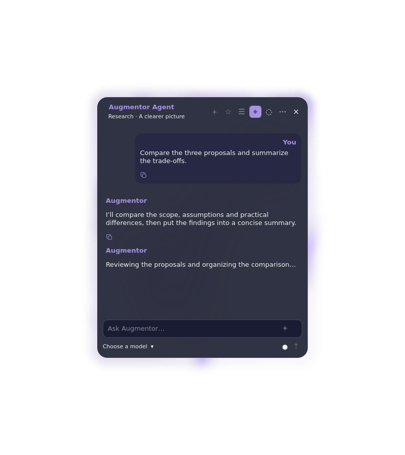

## Archived workspace — September 23, 2026

This is the historical distribution repository. The only active Augmentor Desktop + Browser repository is
[ManoloRemiddi/augmentor-agent](https://github.com/ManoloRemiddi/augmentor-agent), default branch **main**.
Current source, issues, pull requests and future releases belong there.
Existing history, licenses and release downloads are retained here.
Do not repoint this checkout at the active public origin or merge its history.
Preserve local changes and port only selected, privacy-reviewed changes onto a
fresh canonical branch. Older development directions below are historical.
See [repository map and preserved work](https://github.com/ManoloRemiddi/augmentor-agent/blob/main/docs/REPOSITORIES.md).

# Augmentor Agent — Desktop & Browser

Your local or cloud AI, close to the work. A native desktop workspace and matching Chromium sidebar, powered by DeepSeek Harness.

[Website](https://augmentoragent.com/) · [Install](docs/COMPLETE-INSTALL.md) · [Platforms](docs/PLATFORMS.md) · [Discord](https://discord.gg/MRESQnf4R4)

## Complete Linux preview 0.2.10

[Download the complete bundle](https://github.com/ManoloRemiddi/augmentor-agent-app/releases/download/v0.2.10-complete-preview.1/augmentor-0.2.10-complete-preview.1.tar.gz) · [Checksums](https://github.com/ManoloRemiddi/augmentor-agent-app/releases/download/v0.2.10-complete-preview.1/SHA256SUMS) · [Release and reviewed source snapshots](https://github.com/ManoloRemiddi/augmentor-agent-app/releases/tag/v0.2.10-complete-preview.1)

For **Debian 13, Intel/AMD 64-bit**. Extract the archive and run `./install.sh` as your normal user. The guided installer installs the matching desktop/browser runtime, pinned DSH, Model Picker 1.1.2, Adaptive Reasoning 0.2.3 and Resonant Voice 0.1.16. It asks for your own model connection and offers optional local speech and dual memory. Chromium requires a manual **Load unpacked** step. See the [complete guide](docs/COMPLETE-INSTALL.md) for requirements and verification.

This is a fresh-install preview. Existing DSH/Augmentor profiles are refused for a reviewed migration; do not delete your data to bypass this check. Desktop-control qualification is scoped to KDE Plasma Wayland. A container check establishes installation/rendering, not microphone, graphical control or login behavior on every machine.

*Actual app, synthetic conversation. No personal conversation or recording is shown.*

## Included capabilities

- Execution recovery: bounded continuation for empty/truncated replies, protection against exact duplicate changes during recovery, tracked job outcomes and preserved Stop/user handoffs. Included in both editions; no extra plugin installation. See [behavior and limits](docs/LINUX-RELEASE-0.2.10.md).

- Resonant Voice: recording, slide-to-lock, optional hands-free mode and expressive speech playback. Local engines are an optional setup step.
- Separate relationship/project memory adapters, with optional local Hindsight setup and new private stores.
- A second independent conversation window. KDE defaults, when free: Super+Alt+Space and Super+Alt+Shift+Space.
- Consistent desktop selection for login, menu, shortcuts and connection recovery; staged updates and a retained rollback selection.
- Reusable prompts, prompt improvement, conversation actions, readable code and customizable animated skins.
- Desktop computer-control tools and browser-scoped tools in the matching Chromium edition.

Bring your own supported chat model and credentials. The basic wizard configures an OpenAI-compatible text endpoint; advanced capabilities can be configured in DSH. Adaptive Reasoning starts with empty routes to preserve your model's defaults. Guided dual memory currently requires a local numeric-loopback model endpoint.

Breeze speech weights and self-hosted outputs have [research/non-commercial terms](https://huggingface.co/BreezeBlue/Breeze-TTS-2#license-and-responsible-use), separate from the MIT source licenses. Weights are downloaded only if speech is selected; they are not bundled.

## Source, privacy and provenance

The release contains reviewed source snapshots of Augmentor, Resonant Voice and Adaptive Reasoning, exact component commits and SHA-256 checksums. Private development histories remain separate. Packages do not include personal settings, keys, conversations, memory stores, microphone recordings or model weights. New private state is created on the installing machine. Local/cloud models and connected tools retain their own data flows.

## Other platforms and older packages

macOS compatibility is the next priority. Windows and Pi support follow later; these are not supported by this Linux installer. The [Fedora experimental RPM](docs/FEDORA.md) predates the complete voice/memory bundle. [Browser 0.1.32](https://github.com/ManoloRemiddi/augmentor-dsh-extension-plugin/releases/tag/v0.1.32) is a legacy standalone release; do not mix its companion with 0.2.10.

The [September 13 DSH collection](https://github.com/ManoloRemiddi/deepseek-harness-plugins) remains an older set of separate plugin packages. The complete bundle already supplies the required plugins; Metafolder, Wiki and other integrations are optional.

For help, [open an issue](https://github.com/ManoloRemiddi/augmentor-agent-app/issues) with versions, OS and reproduction steps. Remove credentials and private conversation content from reports.
