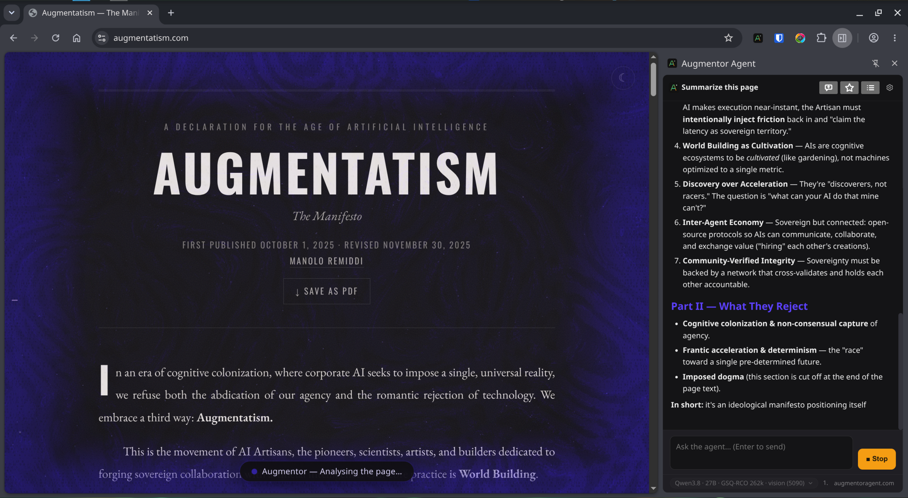

# Augmentor Agent — Browser & Desktop

**Your AI, close to the work.** Augmentor brings DeepSeek Harness into your Chromium browser and a native desktop workspace, with your choice of configured local or cloud models.

[Website](https://augmentoragent.com/) · [Installation](docs/INSTALLATION.md) · [Platform support](docs/PLATFORMS.md) · [Discord](https://discord.gg/MRESQnf4R4) · [YouTube](https://www.youtube.com/@manolo.remiddi)

This is the public documentation and release-information home for both editions. Development code and history are maintained separately. This repository does not contain the application source or private configuration.

## Two editions

### Augmentor Agent Browser

Work in your real Chromium tabs. The agent can read pages, navigate, click and type while you follow the conversation in its sidebar. A visible activity veil shows when it is working.

The public **0.1.32** release is tested on Linux with Chromium and DSH **0.1.5-rc.1**. It includes an extension, a DSH plugin and a native companion. Its DSH preset also includes local command and filesystem tools; access depends on your permissions and configuration.

[Download Browser 0.1.32](https://github.com/ManoloRemiddi/augmentor-dsh-extension-plugin/releases/download/v0.1.32/augmentor-0.1.32-dist.zip) · [Original release and source](https://github.com/ManoloRemiddi/augmentor-dsh-extension-plugin/releases/tag/v0.1.32)

### Augmentor Agent Desktop

A native workspace for conversations and configured DSH capabilities. Choose a show/hide shortcut, bring the agent into view, and switch to a compact activity view when you want it nearby without a full conversation window.

*Actual Desktop interface with staged demonstration content.*

The **0.2.9 Linux preview** is installable from the prepared bundle on **Debian 13, Intel/AMD 64-bit (amd64)**. **The bundle has not yet been published for public download.** Reviewers who already have it can use the installation guide. A separate **[Fedora 44 x86_64 experimental RPM](docs/FEDORA.md)** is now downloadable. It has passed container installation and rendering tests; real desktop integration remains unverified.

Desktop requires the runtime and Desktop packages. The matching Browser extension is optional. DSH, model files, credentials and third-party plugins are separate.

## Features and model choice

- Configured local or cloud models through DeepSeek Harness.
- Reusable prompts, AI prompt improvement and conversation actions in the current development editions.
- Syntax-coloured code blocks and copy controls.
- Desktop colour, transparency and activity-effect customization.
- Desktop shortcut access and expanded/compact views.

Feature availability differs between releases. The **0.2.9 Browser preset is restricted to browser tools and memory recall**; the Desktop integration provides graphical computer-control tools. Do not assume the public 0.1.32 package has every feature shown in development screenshots.

Local inference can keep prompts on your computer. Cloud inference sends requests to your chosen provider. Connected tools, websites and external services have their own data flows.

## Requirements and roadmap

The Browser extension also needs an **Augmentor native companion**; installing DSH alone is not enough. The complete setup is currently verified on Linux. macOS is planned next, followed by Windows. Pi backend support and extensions are deferred; initial Pi support will have fewer capabilities than DSH. No release dates are announced.

See [platform support](docs/PLATFORMS.md) for the exact scope.

## Optional DSH plugins

The [public DSH collection](https://github.com/ManoloRemiddi/deepseek-harness-plugins) contains Augmentor Browser 0.1.32, Metafolder, Model Picker, Adaptive Reasoning and Prompt Library. It is a collection of separate installers, including two previews—not the Desktop installer.

[Download the September 13, 2026 collection](https://github.com/ManoloRemiddi/deepseek-harness-plugins/releases/download/collection-2026.09.13/augmentor-plugins-2026.09.13.zip) · [Collection guide](https://github.com/ManoloRemiddi/deepseek-harness-plugins/blob/main/docs/COLLECTION-INSTALL.md)

## Optional voice input

Our demos use [Handy](https://handy.computer/), a separate open-source speech-to-text app. Focus the Augmentor input, dictate with Handy, review the text, then send. This is not built-in speech playback or a voice-call feature. An Augmentor voice system is planned.

## Help and feedback

Use [Discord](https://discord.gg/MRESQnf4R4) for discussion or [open an issue](https://github.com/ManoloRemiddi/augmentor-agent-app/issues) with your edition, version, operating system and steps to reproduce. Remove credentials, authentication URLs and private conversation content from reports.

[Visit augmentoragent.com](https://augmentoragent.com/) for the product tour and installation prompts.
